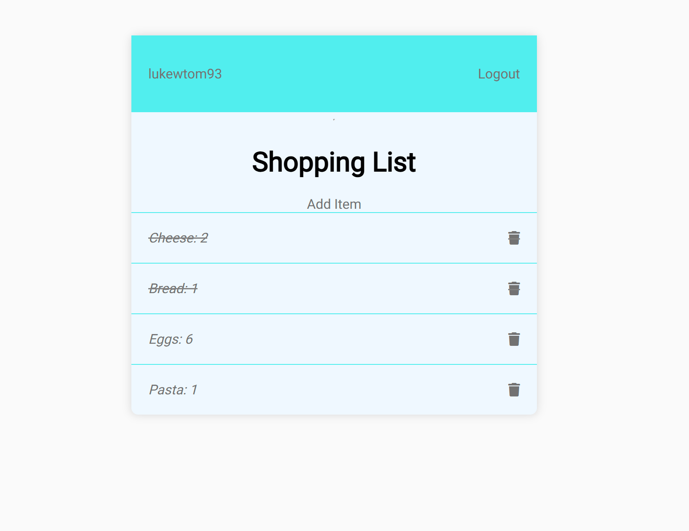
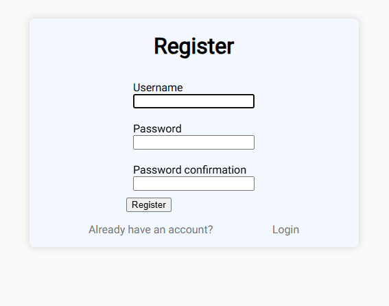
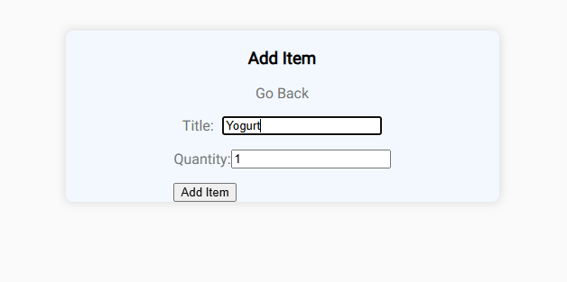
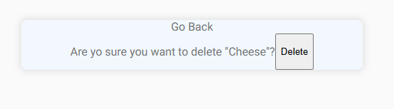
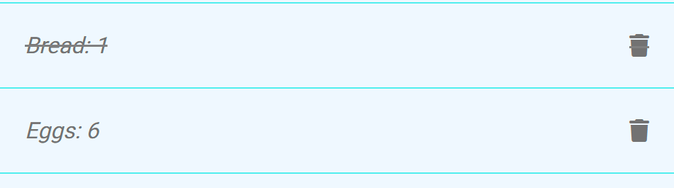
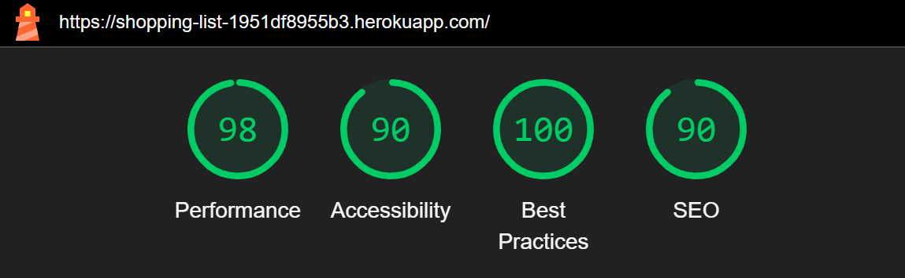

# Shopping List

This is a simple shopping list app hosted on Heroku.

Using CRUD views to create a intuative user experience.



[The live version can be found here](https://shopping-list-1951df8955b3.herokuapp.com/)

## About

Users can create an account and add items delete items and cross out items already purchased.

## Features

### Existing Features

-__Register User__



-__Login__


-__Create Item__



-__Delete Item__



-__Cross Off Item__



### Future Features

-__Add multiple lists__

-__Add Prices__

## Technologies Used

-__Backend__: Django

-__Frontend__: HTML, CSS, Javascript

-__Database__: SQlite, PostgreSQL


### Wire Frames and Mockups

- I used balsamiq to create some wire frames for the Login, Registration and Main Page


## Testing

- using google chrome lighthouse 


### Validator Testing

- HTML
  - No errors were returned when passing through the official W3C HTML Validator
- CSS
  - No errors were found when passing through the official W3C CSS Validator (Jigsaw)
- Python
  - Passed the code through the PEP8 linter and confirmed there are no problems
- Javascript
  - JShint was used to validate JS code for the website.

### Automated Tests

- Python Automated Tests are implimented for user registration, login and logout authentication
- And for the CRUD functionality within the app

- Javascript Automated tests are implimented on the update of an added item

For the Python tests use the terminal command
```bash
python manage.py test
```

For the Javascript Test use the terminal command
```bash
npm test
```

## Setup and Deployment Guide

### Prerequisites

- Ensure you have the following installed:
  - Python (3.8 or later)
  - Node.js and npm 
  - PostgreSQL
  - Git
  - A cloud hosting platform

## Local Setup

### Step 1: Clone the Repository

```bash
git clone <https://github.com/lukewtom93/shopping-list-pp4>
cd shopping-list-pp4
```

### Step 2: Create a Virtual Environment

```bash
python -m venv venv
source venv/bin/activate  # On Windows: venv\Scripts\activate
```

### Step 3: Install Python Dependencies

```bash
pip install -r requirements.txt
```

### Step 4: Set Up the Database

1. Update `settings.py` with your database configuration:
```bash
DATABASES = {
    'default': {
        'ENGINE': 'django.db.backends.postgresql',
        'NAME': '<database_name>',
        'USER': '<database_user>',
        'PASSWORD': '<database_password>',
        'HOST': 'localhost',
        'PORT': '5432',
    }
}
```

2. Apply Migrations:
```bash
python manage.py migrate
```

### Step 5: Collect Static Files

```bash
python manage.py collectstatic
```

### Step 6: Run the Development Server

```bash
python manage.py runserver
```
Visit `http://127.0.0.1:8000` in your browser to verify the application is running.

## Frontend Setup

### Step 1: Install JavaScript Dependencies

Navigate to the directory containing your JavaScript files and run:

```bash
npm install
```
### Step 2: Run Tests

Run Jest tests to ensure your JavaScript functionality works:

```bash
npm test
```

## Deployment

### Step 1: Prepare for Deployment

1. Update `ALLOWED_HOSTS` in `settings.py`:
```bash
ALLOWED_HOSTS = ['your-domain.com']
```
2. Set `DEBUG = False` in `settings.py`.

### Step 2: Configure Static Files

Ensure `WhiteNoise` is installed and configured in `settings.py`:

```bash
MIDDLEWARE = [
    'django.middleware.security.SecurityMiddleware',
    'whitenoise.middleware.WhiteNoiseMiddleware',
]
```

### Step 3: Deploy to Hosting Platform
- Heroku:

1. Install the Heroku CLI and log in:
```bash
heroku login
```
2. Create a new Heroku app:
```bash
heroku create
```
3. Add PostgreSQL to your app:
```bash
heroku addons:create heroku-postgresql:hobby-dev
```
4. Push your code to Heroku:
```bash
git push heroku main
```
5. Run migrations on Heroku:
```bash
heroku run python manage.py migrate
```

Other Platforms: Follow their specific deployment instructions for Django applications.

### Step 4: Verify Deployment
Visit your deployed application’s URL to ensure everything works as expected.


### Credits

- Dennis Ivy's article on class based views found [here](https://dennisivy.com/django-class-based-views)

- for auth views and generic views I used the resources found on [ccbv.co.uk](https://ccbv.co.uk/)